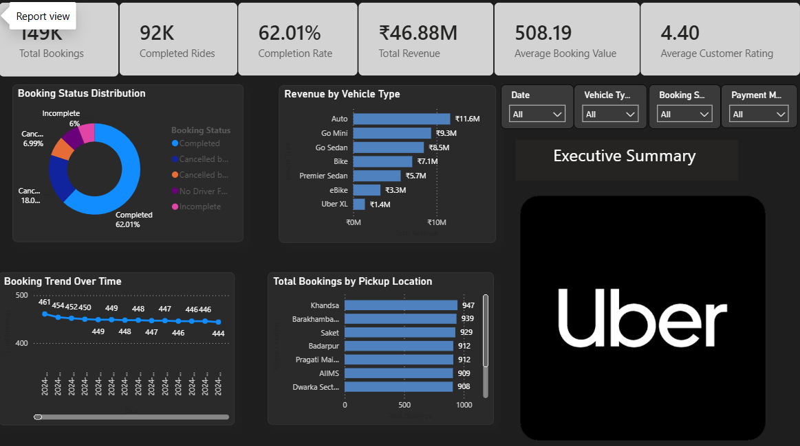
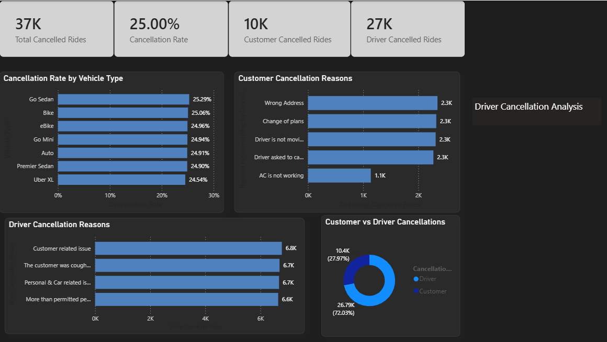
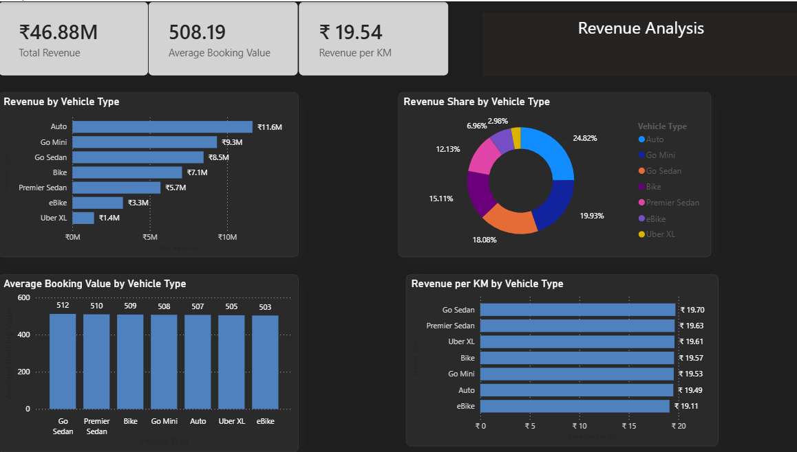

# NCR Ride Booking Analysis

**End-to-end data project: Python cleaning → MySQL storage → SQL analysis → Power BI dashboards**

---

## Table of Contents
- [Project Summary](#project-summary)
- [Problem Statement](#problem-statement)
- [Dataset Description](#dataset-description)
- [Tools Used](#tools-used)
- [Repository Structure](#repository-structure)
- [Key Numbers](#key-numbers)
- [Key Insights](#key-insights)
- [Dashboard Screenshots](#dashboard-screenshots)
- [Connect with Me](#connect-with-me)

---

## Project Summary

Analyzed 149K ride bookings from the NCR (National Capital Region) to understand what drives cancellations, which vehicle types generate the most revenue, and how booking patterns shift across locations and time.

The platform completed 62% of rides, generated ₹46.88M in total revenue, and maintained a stable 12K–13K monthly booking volume — but a 25% cancellation rate and 72% driver-side contribution to cancellations point to fixable operational problems.

---

## Problem Statement

1 in 4 rides is cancelled, and drivers account for nearly 3x more cancellations than customers.

This project identifies the root causes, quantifies their revenue impact, and tracks how performance varies by vehicle type, pickup location, and time period.

---

## Dataset Description

| Field | Detail |
|---|---|
| Source | Synthetic NCR ride booking logs |
| Total Records | ~149,000 bookings |
| Time Period | Full calendar year (Jan–Dec) |
| Key Columns | Booking ID, Customer ID, Booking Status, Vehicle Type, Pickup Location, Drop Location, Booking Value, Ride Distance, Payment Method, Driver Ratings, Customer Rating, Avg VTAT, Avg CTAT, Cancellation Reasons |

---

## Tools Used

| Tool | Purpose |
|---|---|
| Python (Pandas) | Data cleaning and preprocessing |
| MySQL | Data storage and analytical querying |
| Power BI | Dashboard and visual reporting |
| Jupyter Notebook | Exploratory analysis environment |

---

## Repository Structure

```text
├── Data/                       # Processed and raw datasets
├── Notebooks/                  # Jupyter Notebooks for Python ETL
├── Reports/                    # Dashboard screenshots (.png)
├── .gitignore                  # Files to ignore in Git
├── analysis_queries.sql        # SQL analytical queries
├── README.md                   # Project documentation (this file)
└── requirements.txt            # Python dependencies list

## Key Numbers
 * **Total Bookings Analyzed:** 149,000+
 * **Total Revenue Generated:** ₹46.88M
 * **Ride Completion Rate:** 62%
 * **Overall Cancellation Rate:** 25% (1 in 4 rides)
 * **Driver-Side Cancellation Contribution:** 72%

## Key Insights
 * **The Operational Bottleneck:** While the platform maintains a highly stable volume of 12K–13K monthly bookings, overall growth is severely bottlenecked by cancellations.
 * **Driver-Driven Friction:** Drivers account for nearly 3x more cancellations than customers, indicating potential issues with driver churn, trip-distance dissatisfaction, or misaligned pricing incentives.
 * **Revenue Leakage:** With a massive 25% cancellation rate, a significant portion of potential Gross Merchandise Value (GMV) is lost before the trip even begins. Targeting driver-side cancellation reasons presents the highest immediate ROI for revenue recovery.

## Dashboard Screenshots
### 1. Dashboard Overview


### 2. Cancellation Analysis Deep-Dive


### 3. Revenue Analysis


## 🔗 Connect with Me
If you have any questions about this project, want to discuss the data pipeline, or are looking to hire a Data Analyst, feel free to connect!
 * **LinkedIn:** [linkedin.com/in/gadapa-manikanta-532abb304](https://www.linkedin.com/in/gadapa-manikanta-532abb304)
 * **GitHub Profile:** [github.com/GadapaManikanta24](https://github.com/GadapaManikanta24)
 * **Email:** gadapa.mani369@gmail.com
